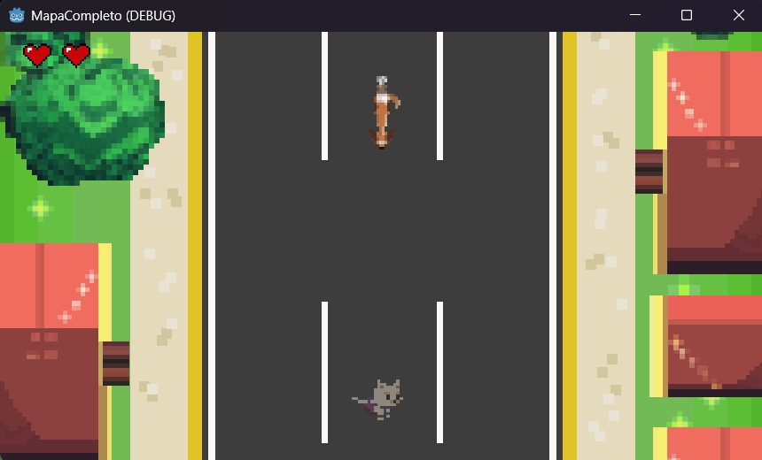
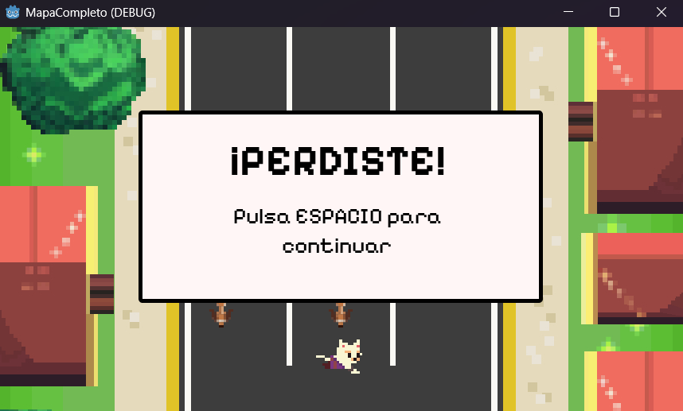
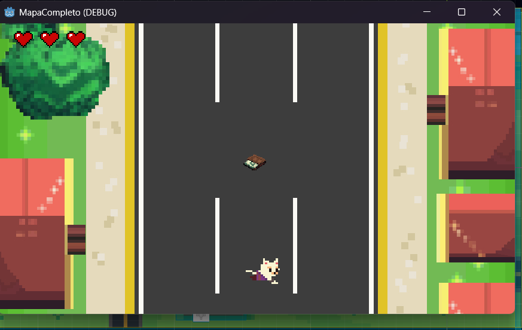
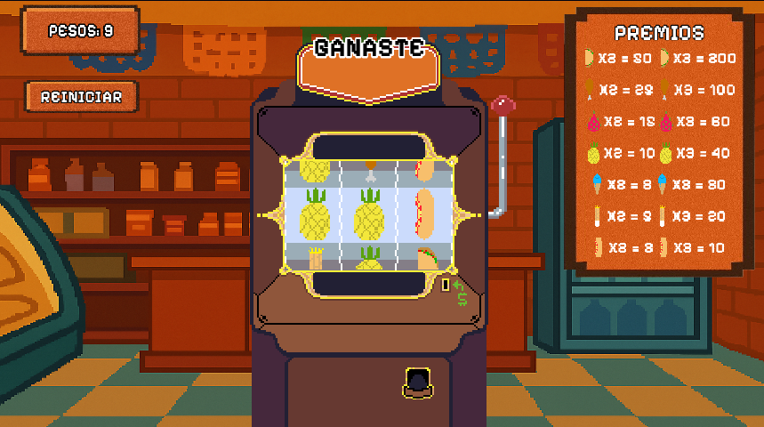
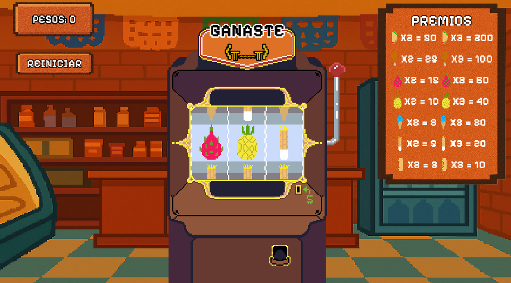

# LoBuscoPeroNoLoEncuentro
Proyecto de servicio social que tiene como objetivo detectar síntomas de depresión en adolescentes a través del PHQ-9, una herramienta de evaluación utilizada para medir la gravedad de los síntomas de depresión.
## Introducción
"Lo busco pero no lo encuentro" es un juego que tiene como objetivo detectar síntomas en adolescentes a través del PHQ-9, una herramienta de evaluación utilizada para medir la gravedad de los síntomas de depresión.
## Descripción del juego
El juego nace de la idea de convertir alguna herramienta de evaluación para detectar síntomas de depresión en adolescentes, en un videojuego. En este sentido, "Lo busco pero no lo encuentro" mapea cada una de las 10 preguntas contenidas en el PHQ-9; en seis diferentes minijuegos que van acompañadas de una historia intrigante para mantener la atención y curiosidad del jugador.
## Interpretación de los resultados

  <table width="100%">
    <tr>
      <td >Total Score</th>
      <td >Depression Severity</th>
    </tr>
    <tr>
      <td>1-4</td>
      <td>Minimal depression</td>
    </tr>
    <tr>
      <td>5-9</td>
      <td>Mild depression</td>
    </tr>
    <tr>
      <td>10-14</td>
      <td>Moderate depression</td>
    </tr>
    <tr>
      <td>15-19</td>
      <td>Moderately severe depression</td>
    </tr>
    <tr>
      <td>20-27</td>
      <td>Severe depression</td>
    </tr>
  </table>

## Conteo de puntos en el juego

Cada pregunta mostrada anteriormente se desplegará en una pantalla con sus respectivas opciones, de las cuales tendrá una puntuación no visible para el jugador pero sí para el maestro o el responsable.
Los puntos se irán sumando a través de un contador y el resultado final solo será visible para las personas autorizadas que lo usarán para su interpretación.   
_Un Ejemplo puede encontrarse dentro del documento GDD detección de los síntomas de depresión en la sección de [Documentos](#Documentos)._  
_Nota: La última pregunta generalmente se encuentra en el **PHQ-9** como un seguimiento de los síntomas deportados en el cuestionario. En este contexto particular del juego, no tiene valor como preguntas anteriores y solo se usará para su análisis cuantitativo y verificar si la puntuación final coincide con la respuesta final del usuario. Por ejemplo, si se obtuvo una puntuación de 20 puntos, esto sugeriría que el usuario podría tener depresión severa, pero si en la última pregunta respondió que no ha sido nada difícil llevar a cabo su vida cotidiana, entonces se podría pensar que no se contestaron adecuadamente las nueve preguntas anteriores._

## Minijuegos
1. Esquiva a los perros   
  **Mecánica**  
  En este minijuego, el jugador puede moverse a la izquierda y a la derecha para esquivar a los perros. Se cuenta con tres       vidas; cada vez que el personaje choque con un perro, se restará una vida. Los perros aparecerán de manera aleatoria entre     las tres calles y avanzarán verticalmente a una velocidad fija. El juego termina cuando el jugador toma la cartera, la cual    aparece después de un tiempo previamente establecido.   

   **Interfaz del juego**
  

      
      
    
  

    

2. Canción de cuna
  **Mecánica**  
   Lorem ipsum dolor sit amet consectetur adipiscing, elit sed est orci velit dictum neque, ultricies magnis posuere morbi mollis. Nisi sem natoque porttitor nunc sociis ligula cum, suscipit faucibus torquent inceptos parturient turpis, posuere mi ut augue eleifend lectus. Pretium montes duis eget commodo dapibus tristique imperdiet, phasellus class urna nunc vehicula vitae aenean, vivamus iaculis diam accumsan risus integer.  

   **Interfaz del juego**
  

    <!-- Insertar imagenes aquí -->
    <!--   
      
     -->
  

3. ¡A comer!
  **Mecánica**  
   En este minijuego, el jugador participa en una máquina de suerte con temática de tiendita de la esquina. Para iniciar una jugada, `debe hacer click en la bola roja de la máquina`, lo que activa las 3 hileras de símbolos. Cada partida tiene un costo de `3 monedas` y el jugador comienza con un total de `9 monedas`.  

   El objetivo es acumular monedas alineando las distintas comidas (tacos, pollo empanizado, pitahaya, piña, helado, amrquesita y hot-dogs). Dependiendo de la combinación obtenida, se otorgan premios en monedas: dos figuras iguales o tres figuras iguales aumentan el saldo del jugador, mientras que no obtener coincidencias no genera recompensa.    

   El juego finaliza de dos maneras:

   * **Victoria**: Al alcanzar `100 monedas`.
   * **Derrota**: Al quedarse `sin monedas`. En este caso, el jugador puede presionar un botón de reinicio para volver a intentarlo.    

   Este minijuego combina azar y expectativa, mateniendo la emoción de cada tirada al mostrar de forma inmediata las ganancias obtenidas según la combinación de alimentos alineados.    

   **Interfaz del juego**
  

      
      
      
    
  

    

4. Buscando las monedas
  **Mecánica**  
   Lorem ipsum dolor sit amet consectetur adipiscing, elit sed est orci velit dictum neque, ultricies magnis posuere morbi mollis. Nisi sem natoque porttitor nunc sociis ligula cum, suscipit faucibus torquent inceptos parturient turpis, posuere mi ut augue eleifend lectus. Pretium montes duis eget commodo dapibus tristique imperdiet, phasellus class urna nunc vehicula vitae aenean, vivamus iaculis diam accumsan risus integer.  

   **Interfaz del juego**
  

    <!-- Insertar imagenes aquí -->
    <!--   
      
     -->
  

5. Dale al topo
  **Mecánica**  
   Lorem ipsum dolor sit amet consectetur adipiscing, elit sed est orci velit dictum neque, ultricies magnis posuere morbi mollis. Nisi sem natoque porttitor nunc sociis ligula cum, suscipit faucibus torquent inceptos parturient turpis, posuere mi ut augue eleifend lectus. Pretium montes duis eget commodo dapibus tristique imperdiet, phasellus class urna nunc vehicula vitae aenean, vivamus iaculis diam accumsan risus integer.  

   **Interfaz del juego**
  

    <!-- Insertar imagenes aquí -->
    <!--   
      
     -->
  

## Estructura de carpetas del Proyecto

res::  
├── [addons]()  
├── [Assets]()  
├── [CreacionPersonaje]()  
├── [Creditos]()  
├── [datosUsuario]()  
├── [Escenas]()  
├── [menuPrincipal]()  
├── [NickUsuario]()  
├── [Player]()  
├── [resources]()  
├── [Scripts]()  
└── [Singleton]()  

_Puedes ver una explicación corta de cada carpeta de la `Estructura de carpetas del proyecto` dandole click._
## Documentos
* [GDD detección de los síntomas de represión](Documentos/GDD%20deteccion%20de%20los%20sintomas%20de%20depresion.pdf)

## Colaboradores

  
  

## Herramientas y Tecnologías

  
  

